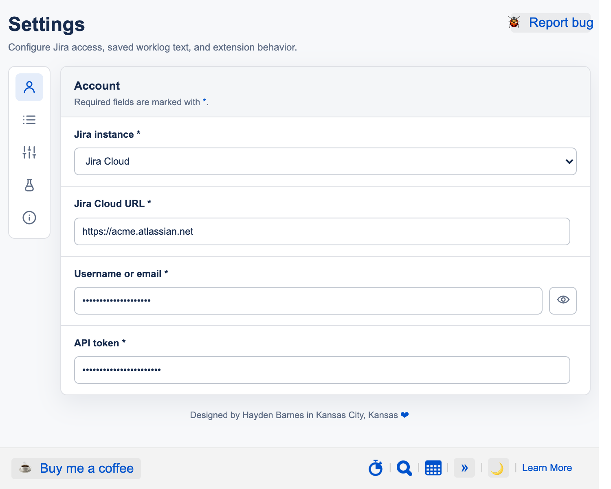
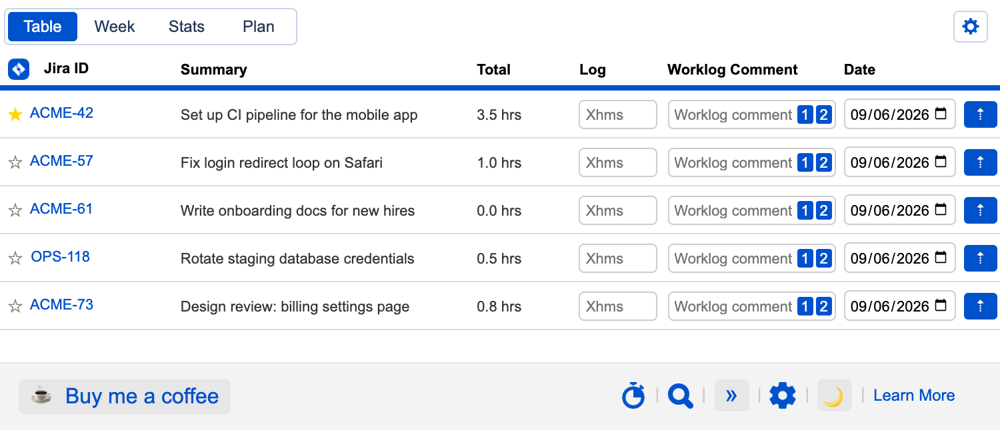
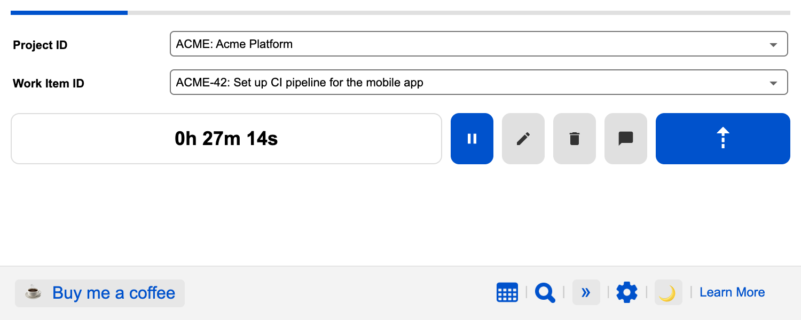
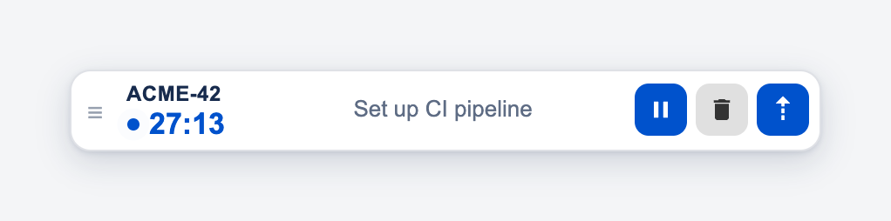
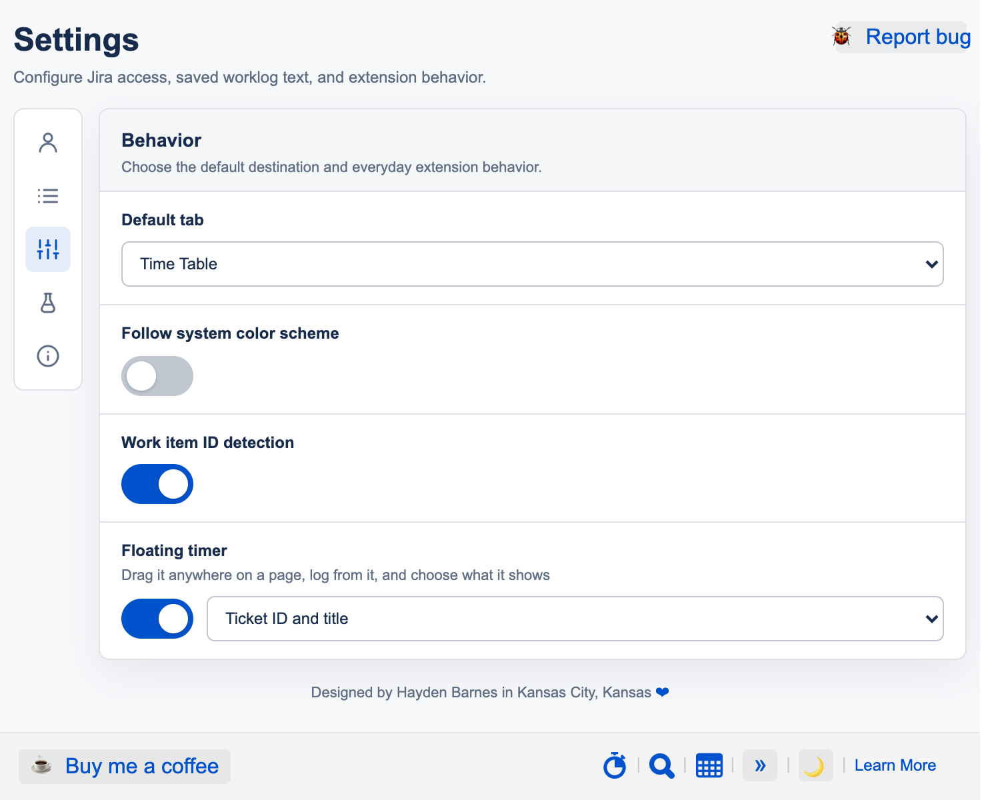
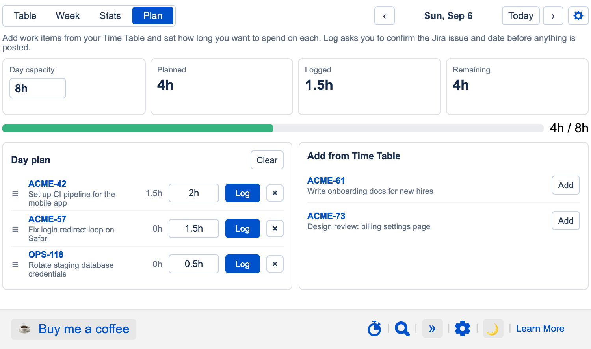

# Getting started

This is the same walkthrough the extension opens on first install. You can reopen it any time from **Settings → About → Open guide**.

All screenshots use sample data (`ACME`/`OPS` projects, `acme.atlassian.net`).

## 1. Connect your Jira account

Open **Settings** (the gear in the top-right corner of the popup, or right-click the toolbar icon → _Options_) and fill in the **Account** page:

1. **Jira instance** – _Jira Cloud_ for `*.atlassian.net` sites, _Jira Server_ for self-hosted Server / Data Center.
2. **Jira URL** – for example `https://your-team.atlassian.net`.
3. **Username or email** – the email on your Atlassian account (Cloud) or your Jira username (Server).
4. **API token** – on Cloud, create one at [id.atlassian.com → Security → API tokens](https://id.atlassian.com/manage-profile/security/api-tokens). On Server / Data Center, use a personal access token from your profile (or your password if tokens are disabled).
5. Click **Save** next to each field you change.

## 2. Log time from the Time Table

Click the extension icon. The **Table** tab lists your work items, one row per issue.

- Rows come from a JQL query. The default shows issues assigned to you or that you have logged time on, excluding Closed and Done. Change it from the gear at the top right of the table.
- Type a duration in **Log** (`1h 30m`, `45m`, `2h`), add an optional comment, pick the date, and press the blue **⇡** button on the row.
- **★** pins an issue to the top. Hover an issue key to see its last five worklogs.
- The **1** and **2** buttons insert your saved worklog snippets (Settings → Worklog snippets).
- The gear also toggles the Status, Assignee, Total, and Comment columns, sets the sort order, and lets you drag columns into a new order.
- **Week** and **Stats** show what you have already logged.

## 3. Track work with the Timer

Open the stopwatch icon in the footer, or make the Timer your default tab under Settings → Behavior.

1. Pick a **Project ID** and **Work Item ID**, or type a key such as `ACME-42` directly. The project follows the key you type.
2. Press **▶** to start. The timer keeps running while the popup is closed, and the toolbar badge shows the elapsed time.
3. **✎** edits the elapsed time, **🗑** resets, **💬** adds a worklog comment.
4. Press **⇡** to log the elapsed time. The timer resets after a successful log.

## 4. Keep the timer in view on any page

Turn on **Floating timer** under Settings → Behavior and a small pill follows you onto every web page.

- Shows the current work item and elapsed time; choose ID and title, title only, or ID only.
- Drag it anywhere by the grip on the left; it remembers its spot.
- **▶ / ⏸** starts and pauses, **🗑** resets, **⇡** opens a confirmation showing exactly what will be logged. A green outline and a short chime confirm success.
- Hover the grip for three seconds and it becomes **✕**. Clicking it hides the floating timer without stopping the timer; turn it back on in Settings.

## 5. Plan your day

The **Plan** tab lays out how you want to spend the day and lets you log each block when it is done.

1. Set your **Day capacity** (for example 8h).
2. **Add** work items from your Time Table and give each a planned duration. Drag the ☰ handle to reorder.
3. Press **Log** on a row. A dialog shows the issue, date, and time that will be posted; confirm to log it.
4. Use the arrows next to the date to plan tomorrow or review earlier days.

## More ways to save time

- **Work item detection** – issue keys on any web page get a small timer icon; click it to log time without leaving the page (Settings → Behavior).
- **Search** – the magnifier in the footer finds any issue, even outside your JQL, and logs time to it.
- **CLI** – the » page takes one-line commands like `ACME-42 1h 30m yesterday Fix tests`.
- **Worklog snippets** – save two comment presets and insert them with the 1 and 2 buttons.
- **Dark mode** – the 🌙 button in the footer, or follow your system theme from Settings → Behavior.
- **Full-page view** – under Settings → Experimental, open the extension in a tab instead of a popup.

## About the screenshots

The images in `src/images/onboarding/` are rendered from the built extension pages in headless Chrome with stubbed `chrome.*` APIs and a fake Jira backend (sample projects, issues, and worklogs). They contain no real account data. If you replace them, keep using sample data and the same 750px-wide, 2x-scale captures so the guide stays consistent.
